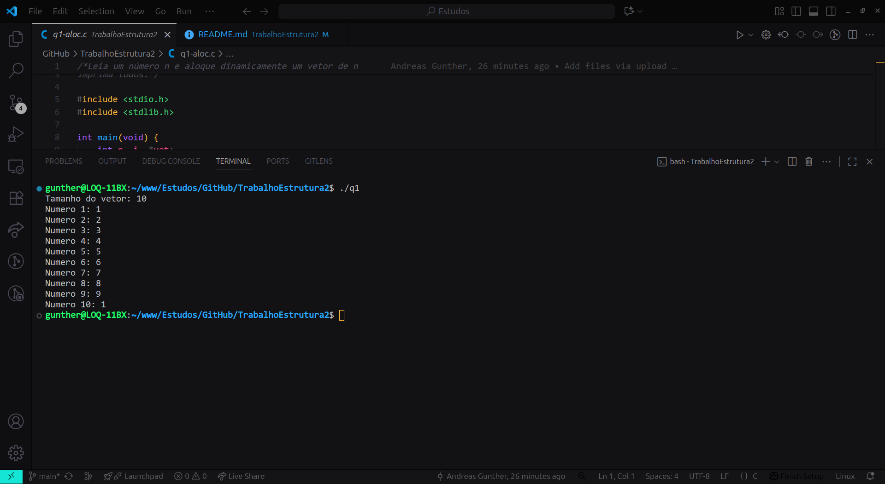
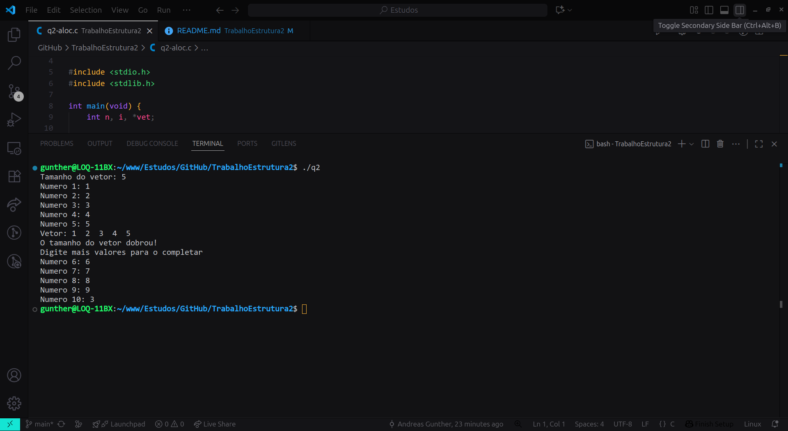

# TrabalhoEstrutura2

# Trabalho Prático Alocação Dinâmica
Equipe: Andreas Gunther, Davi Carvalho e Marcos Henrique.

Desenvolver, em equipes, as atividades postadas no classroom em C que utilize alocação dinâmica de forma correta e explícita, aplicando os conceitos vistos em sala.

Esse trabalho envolve a implementação dos conceitos de alocação dinâmica em que possuimos o malloc, calloc, realloc e o free, cada um desempenhando um papel fundamental em cada parte do código:
Malloc: Inicializa a memória com o tamanho decidido e com valores aleatórios.
Calloc: inicializa a memória com 0's.
Realloc: Tem a capacidade de mudar o tamanho da memória que já tinha sido determinada.
Free: Libera o espaço da memória utlizado.

## Estrutura dos arquivos

* **q1-aloc.c** → Exercício 1 de alocação dinâmica.
* **q2-aloc.c** → Exercício 2 de alocação dinâmica.
* **q3-aloc.c** → Exercício 3 de alocação dinâmica.
* **q4-aloc.c** → Exercício 4 de alocação dinâmica.
* **q5-aloc.c** → Exercício 5 de alocação dinâmica.

Cada arquivo é independente e contém:

* Entrada de dados pelo usuário.
* Uso de ponteiros e malloc/calloc/realloc.
* Processamento dos dados (ex.: armazenar, manipular ou calcular valores).
* Liberação da memória com free().

## Como compilar e executar

No terminal, utilize o gcc para compilar e executar cada programa:

gcc q1-aloc.c -o q1
./q1

gcc q2-aloc.c -o q2
./q2

(O mesmo vale para q3, q4, q5.)

## Prints dos códigos em execução

* **q1-aloc.c**
  

* **q2-aloc.c**
  

